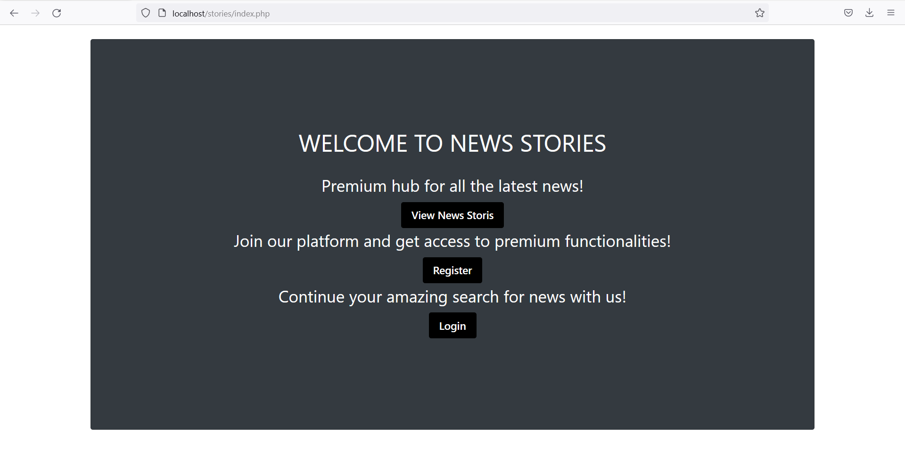
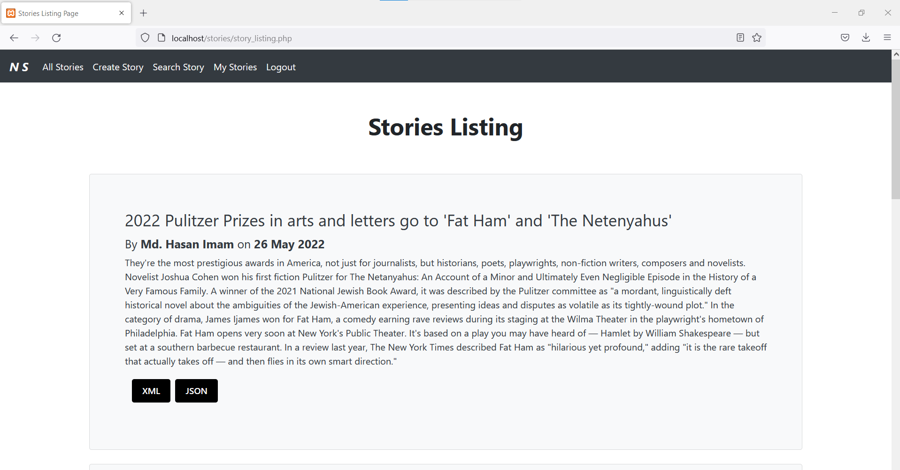
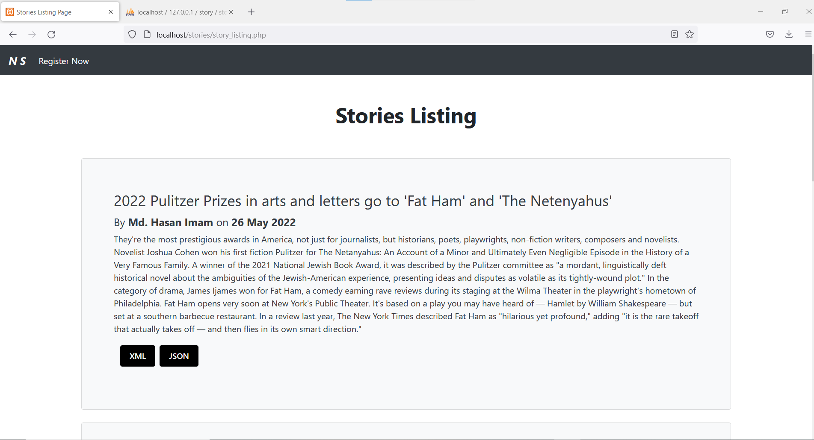
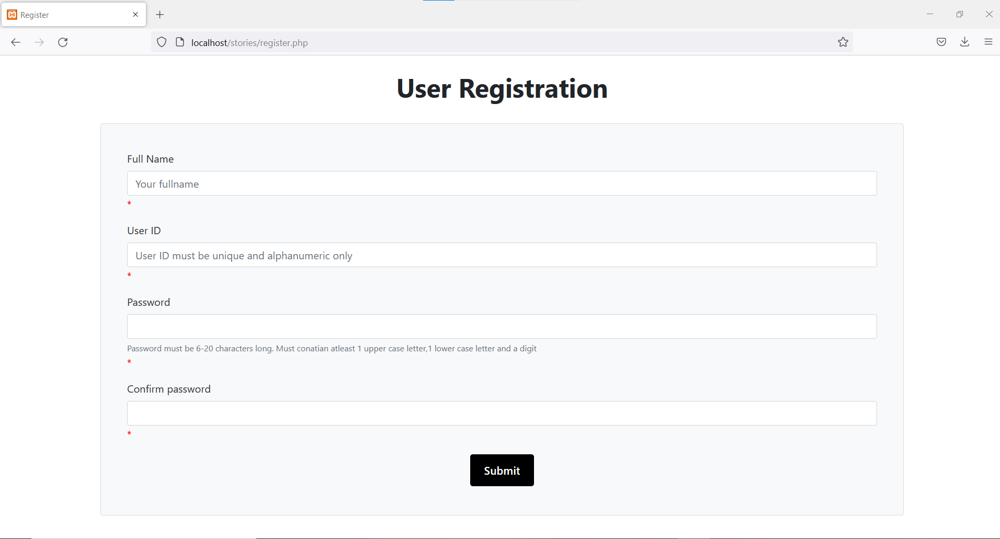

# News Story Web Application.

## Setting Up
1. Necessary tools - Visual Studio Code &XAMPP & Apache/2.4.51 (Win64) & OpenSSL/1.1.1l & PHP/7.3.31 
2. Download the project or clone from github.
3. Store the project in /xampp/htdocs
3. Open XAMPP and start Apache and MySQL
4. Open the database_init.sql file using SQL Server. This will generate the Database tables and stored procedures.
5. Open any web browser and search "localhost/Stories"
5. Now the web application is ready to to be accessed.
-----------------------
## Views
### Index

### Story Listing Page Logged In

### Story Listing Page Guest

### User Register

### Create New Story

### Edit Story

### Search Story 1

### Search Story 2

### JSON output

### XML output

### Delete confirmation

-----------------------
## Status
### Phase 1
1. Created the page for creating a new story. [x]
2. Story is stored in the Database. [x]

### Phase 2
1. Display a list of stories. [x]
2. Display the list in descending order. [x]
3. Added pagination to stories listing page. [x]

### Phase 3
1. Edit functionality. [x]
2. Delete functionality after confirmation. [x]

### Phase 4
1. Export the stories as JSON. [x]
2. Export the stories as XML. [x]

### Phase 5
1. Authentication layer. [x]
2. Logged in user can create new story. [x]
3. Logged in user can edit or delete only his/her stories. [x]
4. Anyone on the web can access stories listing page and export data but access to other pages is restricted.[x]
4. User can logout[x]

### Addition Phase

1. Added stories search page[x]
2. Stories can be searched by title/author/single keyword[x]

### Extra features for completeness

1. Created index page.[x]
2. Created nav bar.[x]
3. Created my stories page. Registered users has easy access to all thier stories.[x]
